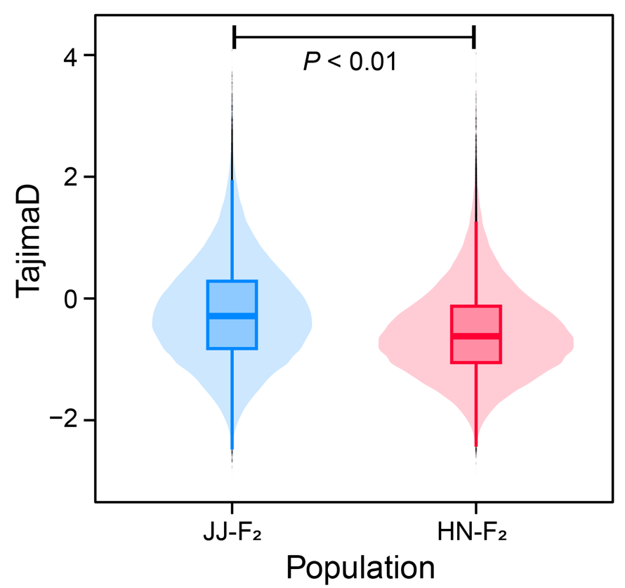
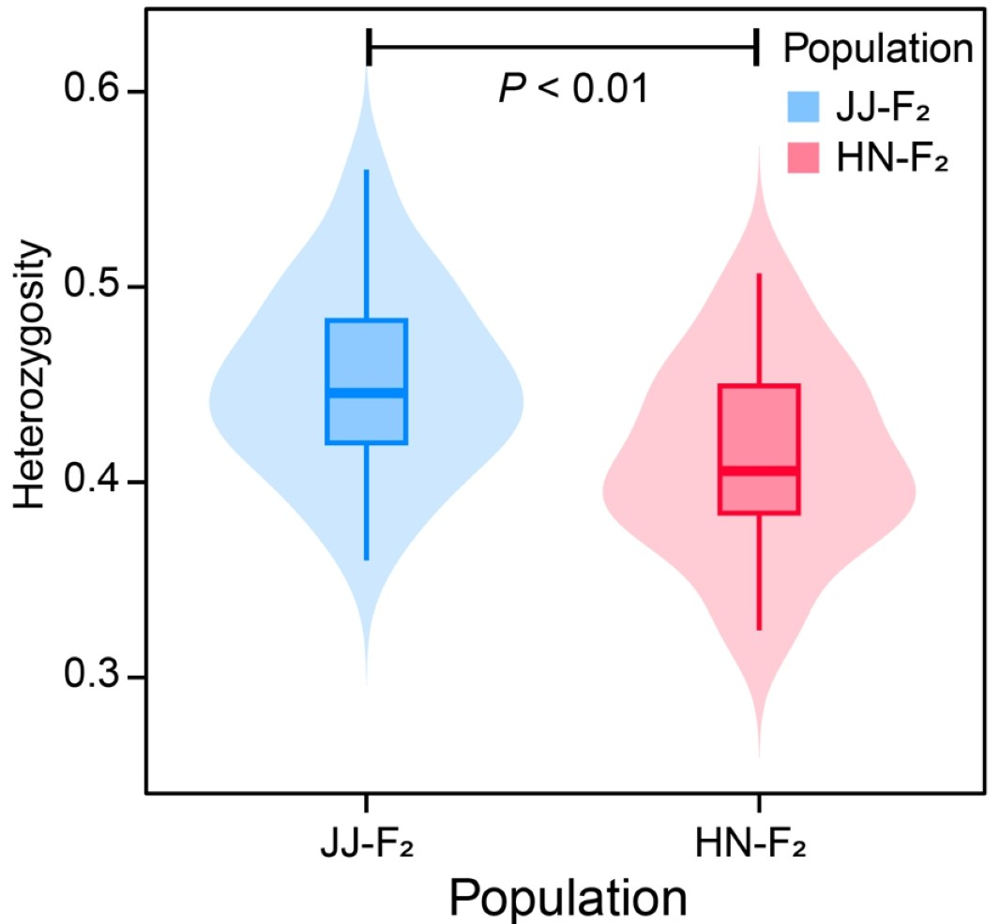
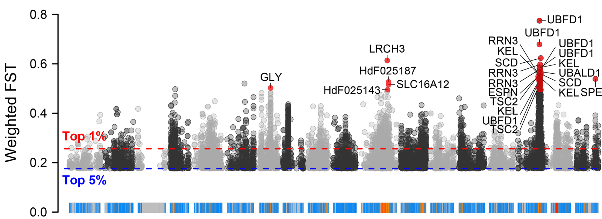
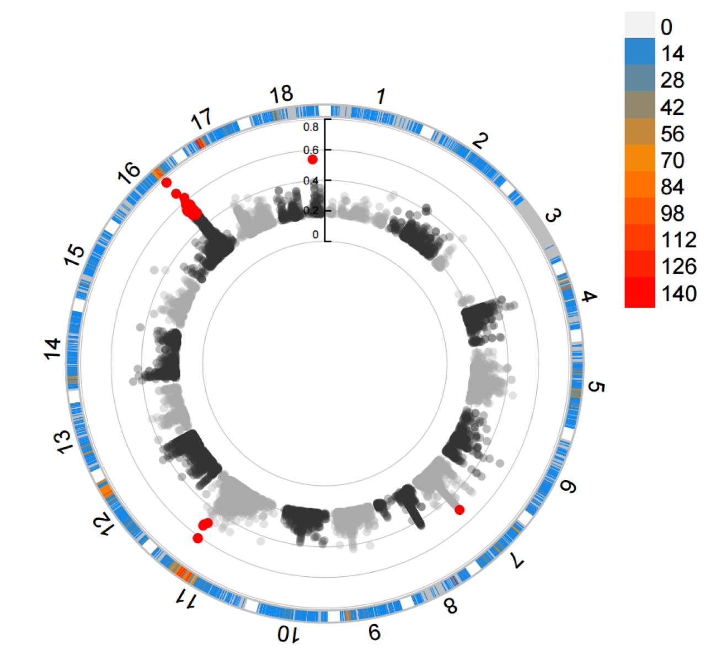

# PopGeneticsVis
PopGeneticsVis: a toolkit for whole-genome resequencing and bisulfite sequencing downstream visualization in population genetics.

## 1. Installation

### 1.1 R with Packages

```R
# 1. R: >= v4.3.0

# 2. Packages
install.packages("argparse")
install.packages("dplyr")
install.packages("ggplot2")
```

### 1.2 Download from GitHub Release

*https://github.com/benben-miao/PopGeneticsVis/releases*

### 1.3 Clone Git Repository

```bash
# 1. Clone
git clone https://github.com/benben-miao/PopGeneticsVis.git

# 2. Test
Rscript ./PopGeneticsVis/bin/plink_pca_vis.R --help

usage: ./PopGeneticsVis/bin/plink_pca_vis.R [-h] --eigenvec EIGENVEC --eigenval EIGENVAL
                             --sample_pop SAMPLE_POP --select_pops SELECT_POPS
                             [--x_pc X_PC] [--y_pc Y_PC]
                             [--point_size POINT_SIZE]
                             [--point_alpha POINT_ALPHA]

PCA Visualization for PLINK PCA Eigenvec

optional arguments:
  -h, --help            show this help message and exit
  --eigenvec EIGENVEC   PLINK PCA results [pca.eigenvec].
  --eigenval EIGENVAL   PLINK PCA results [pca.eigenval].
  --sample_pop SAMPLE_POP
                        Table with samples in col1, pops in col2
                        [sample_pop.txt].
  --select_pops SELECT_POPS
                        Select populations ['GroupA,GroupB'].
  --x_pc X_PC           Which PC for X Axis [1].
  --y_pc Y_PC           Which PC for Y Axis [2].
  --point_size POINT_SIZE
                        Points size [4].
  --point_alpha POINT_ALPHA
                        Points alpha [0.8].
```

## 2. Documents

### 2.1 WGRS PLINK PCA Vis

```bash
Rscript ./PopGeneticsVis/bin/plink_pca_vis.R --help

usage: ./PopGeneticsVis/bin/plink_pca_vis.R [-h] --eigenvec EIGENVEC --eigenval EIGENVAL
                             --sample_pop SAMPLE_POP --select_pops SELECT_POPS
                             [--x_pc X_PC] [--y_pc Y_PC]
                             [--point_size POINT_SIZE]
                             [--point_alpha POINT_ALPHA]

PCA Visualization for PLINK PCA Eigenvec

optional arguments:
  -h, --help            show this help message and exit
  --eigenvec EIGENVEC   PLINK PCA results [pca.eigenvec].
  --eigenval EIGENVAL   PLINK PCA results [pca.eigenval].
  --sample_pop SAMPLE_POP
                        Table with samples in col1, pops in col2
                        [sample_pop.txt].
  --select_pops SELECT_POPS
                        Select populations ['GroupA,GroupB'].
  --x_pc X_PC           Which PC for X Axis [1].
  --y_pc Y_PC           Which PC for Y Axis [2].
  --point_size POINT_SIZE
                        Points size [4].
  --point_alpha POINT_ALPHA
                        Points alpha [0.8].
```

#### 2.1.1 Termial Running

```bash
Rscript \
	./PopGeneticsVis/bin/plink_pca_vis.R \
	--eigenvec ./PopGeneticsVis/data/plink_pca/pca.eigenvec \
	--eigenval ./PopGeneticsVis/data/plink_pca/pca.eigenval \
	--sample_pop ./PopGeneticsVis/data/plink_pca/samples_pops.txt \
	--select_pops "JJ_G2,HN_G2" \
	--x_pc 1 --y_pc 2 \
	--point_size 4 --point_alpha 0.8
```


#### 2.1.2 PLINK PCA results `./PopGeneticsVis/data/plink_pca/pca.eigenvec`

```bash
head -n 10 ./PopGeneticsVis/data/plink_pca/pca.eigenvec

#FID    IID     PC1     PC2     PC3     PC4     PC5     PC6     PC7     PC8     PC9     PC10
HN_G2_1 HN_G2_1 0.04043 -0.0253789      0.0367277       0.00133413      -0.100252       -0.0905802      0.0113605       -0.0137787      -0.00668236     0.0167026
HN_G2_10        HN_G2_10        0.0212835       0.00859226      -0.0506521      -0.023103       0.0270852       -0.0357936      0.00354596      -0.020354       1.16024e-05     0.0141656
HN_G2_11        HN_G2_11        0.0127448       0.00981976      -0.067746       -0.0214325      -0.0301917      -0.0183634      -0.0200866      -0.00592332     -0.0141271      0.14919
HN_G2_12        HN_G2_12        0.0172671       0.022466        -0.0228558      0.0474678       -0.05247        0.0371412       -0.0215446      -0.0304079      0.0416183       0.0017122
HN_G2_13        HN_G2_13        0.0292439       0.0168136       -0.00497563     0.0267906       -0.0675681      0.0251754       -0.00228862     -0.0429644      0.0618089       -0.0117392
HN_G2_14        HN_G2_14        0.0158522       0.0359309       -0.0488923      0.0203213       0.00240803      -0.012922       0.0210997       -0.0185264      0.0167203       0.0338862
HN_G2_15        HN_G2_15        0.00289866      -0.00861881     -0.0898324      0.0208598       0.0670552       -0.173035       -0.035361       -0.0510791      -0.0171244      -0.0316206
HN_G2_16        HN_G2_16        0.0265133       0.00541896      -0.045698       -0.0219957      0.0469065       0.0547635       0.0421172       -0.0974258      -0.0106709      0.0287779
HN_G2_17        HN_G2_17        0.0250258       0.0229324       -0.0335188      0.00408936      -0.00744732     -0.0204986      0.023825        -0.010836       0.069014        0.0448165
```

#### 2.1.3 PLINK PCA results `./PopGeneticsVis/data/plink_pca/pca.eigenval`

```bash
cat ./PopGeneticsVis/data/plink_pca/pca.eigenval

9.91596
7.34118
5.66223
4.90547
4.37931
4.00635
3.89641
3.54522
3.51559
3.16454
```

#### 2.1.4 WGRS `./PopGeneticsVis/data/plink_pca/samples_pops.txt`

```bash
head -n 10 ./PopGeneticsVis/data/plink_pca/samples_pops.txt

HN_G2_1 HN_G2
HN_G2_2 HN_G2
HN_G2_3 HN_G2
HN_G2_4 HN_G2
HN_G2_5 HN_G2
HN_G2_6 HN_G2
HN_G2_7 HN_G2
HN_G2_8 HN_G2
HN_G2_9 HN_G2
HN_G2_10        HN_G2
```

### 2.2 WGRS VCFtools Tajima'D Vis

```bash
usage: ./PopGeneticsVis/bin/vcftools_tajimad_vis.R [-h] --tajimad_win TAJIMAD_WIN --select_pops SELECT_POPS
                   [--box_outliers BOX_OUTLIERS]

VCFtools TajimaD Violin Box Vis

optional arguments:
  -h, --help            show this help message and exit
  --tajimad_win TAJIMAD_WIN
                        VCFtools TajimaD with ordered POP [all.Tajima.D].
  --select_pops SELECT_POPS
                        Select populations ['GroupA,GroupB'].
  --box_outliers BOX_OUTLIERS
                        Show box outliers uppercase [FALSE].
```

#### 2.2.1 Terminal Running

```bash
Rscript \
	./PopGeneticsVis/bin/vcftools_tajimad_vis.R \
	--tajimad_win ./PopGeneticsVis/data/vcftools_tajimad/all.Tajima.D \
	--select_pops "JJ_G2,HN_G2" \
	--box_outliers TRUE
```



#### 2.2.2 VCFtools Tajima'D results `./PopGeneticsVis/data/vcftools_tajimad/all.Tajima.D`

```bash
head -n 10 ./PopGeneticsVis/data/vcftools_tajimad/all.Tajima.D

CHROM   BIN_START       N_SNPS  TajimaD POP
11      10000   4       -1.51583        HN_G2
11      20000   0       nan     HN_G2
11      30000   3       -0.504447       HN_G2
11      40000   0       nan     HN_G2
11      50000   0       nan     HN_G2
11      60000   0       nan     HN_G2
11      70000   0       nan     HN_G2
11      80000   0       nan     HN_G2
11      90000   0       nan     HN_G2
```

### 2.3 WGRS PLINK Heterozyg Vis

```bash
usage: ./PopGeneticsVis/bin/plink_heterozyg_vis.R [-h] --het_data HET_DATA --sample_pop SAMPLE_POP --select_pops
             SELECT_POPS [--point_size POINT_SIZE]

PLINK Heterozyg Violin Box Vis

optional arguments:
  -h, --help            show this help message and exit
  --het_data HET_DATA   PLINK Heterozyg results [het.het].
  --sample_pop SAMPLE_POP
                        Table with IID in col1 and Population in col2
                        [sample_pop.txt].
  --select_pops SELECT_POPS
                        Select populations ['GroupA,GroupB'].
  --point_size POINT_SIZE
                        Point size [2].
```

#### 2.3.1 Terminal Running

```bash
Rscript \
	./PopGeneticsVis/bin/plink_heterozyg_vis.R \
	--het_data ./PopGeneticsVis/data/plink_het/het.het \
	--sample_pop ./PopGeneticsVis/data/plink_het/samples_pops.txt \
	--select_pops "JJ_G2,HN_G2" \
	--point_size 2
```



#### 2.3.2 PLINK Heterozyg results `./PopGeneticsVis/data/plink_het/het.het`

```bash
head -n 10 ./PopGeneticsVis/data/plink_het/het.het

#FID	IID	O(HOM)	E(HOM)	OBS_CT	F
HN_G2_1	HN_G2_1	19048512	1.81455e+07	20585181	0.370148
HN_G2_10	HN_G2_10	19053719	1.804e+07	20467745	0.417557
HN_G2_11	HN_G2_11	18950164	1.79458e+07	20366876	0.414843
HN_G2_12	HN_G2_12	19064469	1.79607e+07	20383072	0.455651
HN_G2_13	HN_G2_13	19222145	1.8105e+07	20549246	0.457051
HN_G2_14	HN_G2_14	18908338	1.8013e+07	20444064	0.368286
HN_G2_15	HN_G2_15	19256769	1.80381e+07	20474025	0.50029
HN_G2_16	HN_G2_16	19041670	1.80191e+07	20453626	0.420034
HN_G2_17	HN_G2_17	19309606	1.81539e+07	20603448	0.471799
```

#### 2.3.3 WGRS `./PopGeneticsVis/data/plink_het/samples_pops.txt`

```bash
head -n 10 ./PopGeneticsVis/data/plink_het/samples_pops.txt

HN_G2_1 HN_G2
HN_G2_2 HN_G2
HN_G2_3 HN_G2
HN_G2_4 HN_G2
HN_G2_5 HN_G2
HN_G2_6 HN_G2
HN_G2_7 HN_G2
HN_G2_8 HN_G2
HN_G2_9 HN_G2
HN_G2_10        HN_G2
```

### 2.4 WGRS VCFtools FST and XPCLR XPCLR Vis

```bash
usage: ./PopGeneticsVis/bin/cmplot_fst_xpclr.R [-h] [--method {FST,XPCLR}] --fst_xpclr FST_XPCLR
                      [--plot_type {m,c,d,q}]

CMplot for FST or XPCLR results annotation

optional arguments:
  -h, --help            show this help message and exit
  --method {FST,XPCLR}  SNP selection methods [FST].
  --fst_xpclr FST_XPCLR
                        FST or XPCLR results with anno [fst.anno].
  --plot_type {m,c,d,q}
                        Plot type m(Manhattan), c(Circle), d(Density), q(QQ-
                        plot) [m].
```

#### 2.4.1 Terminal Running

```bash
Rscript \
	./PopGeneticsVis/bin/cmplot_fst_xpclr.R \
	--method FST \
	--fst_xpclr ./PopGeneticsVis/data/vcftools_fst/FST_JJ_G2_vs_HN_G2.windowed.weir.fst.chr.anno \
	--plot_type d
```


```bash
Rscript \
	./PopGeneticsVis/bin/cmplot_fst_xpclr.R \
	--method FST \
	--fst_xpclr ./PopGeneticsVis/data/vcftools_fst/FST_JJ_G2_vs_HN_G2.windowed.weir.fst.chr.anno \
	--plot_type m
```



```bash
Rscript \
	./PopGeneticsVis/bin/cmplot_fst_xpclr.R \
	--method FST \
	--fst_xpclr ./PopGeneticsVis/data/vcftools_fst/FST_JJ_G2_vs_HN_G2.windowed.weir.fst.chr.anno \
	--plot_type c
```



#### 2.4.2 VCFtools FST results `./PopGeneticsVis/data/vcftools_fst/FST_JJ_G2_vs_HN_G2.windowed.weir.fst.chr.anno`

```bash
head -n 10 ./PopGeneticsVis/data/vcftools_fst/FST_JJ_G2_vs_HN_G2.windowed.weir.fst.chr.anno

CHROM   BIN_START       BIN_END N_VARIANTS      WEIGHTED_FST    MEAN_FST        anno_type       gene_id
chr11   10001   20000   7       0.0436644       0.0239114       promoter,gene,UTR5,CDS,exon,intron,UTR3 HdF041849(p),HdF041849(g)
chr11   15001   25000   7       0.0436644       0.0239114       promoter,gene,UTR5,exon,intron  HdF041849(p),HdF041849(g)
chr11   25001   35000   4       0.0150391       0.0161973       intergenic
chr11   30001   40000   4       0.0150391       0.0161973       intergenic
chr11   55001   65000   1       -0.00444874     -0.00444874     intergenic
chr11   60001   70000   1       -0.00444874     -0.00444874     intergenic
chr11   270001  280000  15      0.0511696       0.0366771       gene,UTR5,CDS,exon,intron,UTR3  HdF041844(g)
chr11   275001  285000  15      0.0511696       0.0366771       gene,UTR5,exon,intron   HdF041844(g)
chr11   300001  310000  8       0.0526581       0.0448139       intergenic
```
