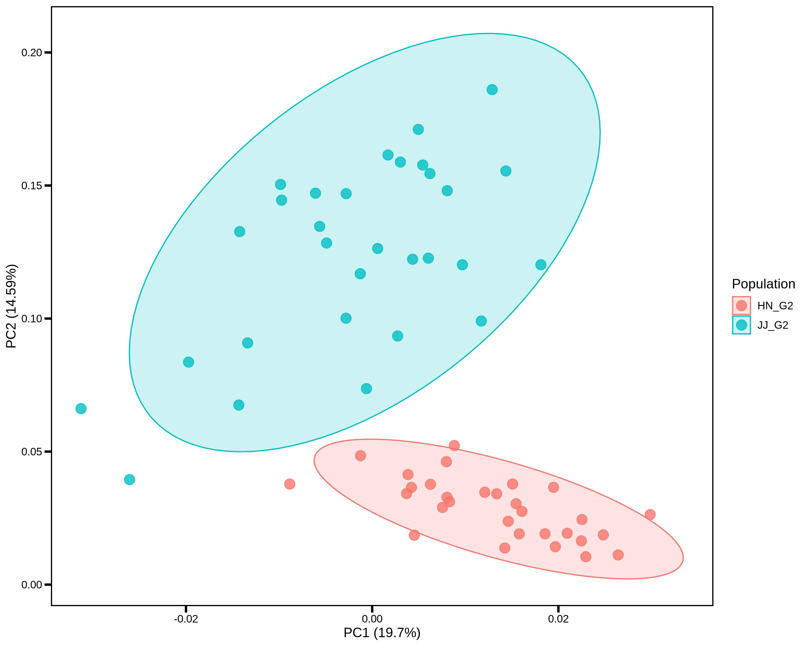

# PopGeneticsVis
PopGeneticsVis: a toolkit for whole-genome resequencing and bisulfite sequencing downstream visualization in population genetics.

## 1. Installation

### 1.1 R with Packages

```R
# 1. R: >= v4.3.0

# 2. Packages
install.packages("argparse")
install.packages("dplyr")
install.packages("ggplot2")
```

### 1.2 Download from GitHub Release

*https://github.com/benben-miao/PopGeneticsVis/releases*

### 1.3 Clone Git Repository

```bash
# 1. Clone
git clone https://github.com/benben-miao/PopGeneticsVis.git

# 2. Test
Rscript ./PopGeneticsVis/bin/plink_pca_vis.R --help

usage: ./PopGeneticsVis/bin/plink_pca_vis.R [-h] --eigenvec EIGENVEC --eigenval EIGENVAL
                             --sample_pop SAMPLE_POP --select_pops SELECT_POPS
                             [--x_pc X_PC] [--y_pc Y_PC]
                             [--point_size POINT_SIZE]
                             [--point_alpha POINT_ALPHA]

PCA Visualization for PLINK PCA Eigenvec

optional arguments:
  -h, --help            show this help message and exit
  --eigenvec EIGENVEC   PLINK PCA results [pca.eigenvec].
  --eigenval EIGENVAL   PLINK PCA results [pca.eigenval].
  --sample_pop SAMPLE_POP
                        Table with samples in col1, pops in col2
                        [sample_pop.txt].
  --select_pops SELECT_POPS
                        Select populations ['GroupA,GroupB'].
  --x_pc X_PC           Which PC for X Axis [1].
  --y_pc Y_PC           Which PC for Y Axis [2].
  --point_size POINT_SIZE
                        Points size [4].
  --point_alpha POINT_ALPHA
                        Points alpha [0.8].
```

## 2. Documents

### 2.1 WGRS PLINK PCA Vis

```bash
Rscript ./PopGeneticsVis/bin/plink_pca_vis.R --help

usage: ./PopGeneticsVis/bin/plink_pca_vis.R [-h] --eigenvec EIGENVEC --eigenval EIGENVAL
                             --sample_pop SAMPLE_POP --select_pops SELECT_POPS
                             [--x_pc X_PC] [--y_pc Y_PC]
                             [--point_size POINT_SIZE]
                             [--point_alpha POINT_ALPHA]

PCA Visualization for PLINK PCA Eigenvec

optional arguments:
  -h, --help            show this help message and exit
  --eigenvec EIGENVEC   PLINK PCA results [pca.eigenvec].
  --eigenval EIGENVAL   PLINK PCA results [pca.eigenval].
  --sample_pop SAMPLE_POP
                        Table with samples in col1, pops in col2
                        [sample_pop.txt].
  --select_pops SELECT_POPS
                        Select populations ['GroupA,GroupB'].
  --x_pc X_PC           Which PC for X Axis [1].
  --y_pc Y_PC           Which PC for Y Axis [2].
  --point_size POINT_SIZE
                        Points size [4].
  --point_alpha POINT_ALPHA
                        Points alpha [0.8].
```

#### 2.1.1 Termial Running

```bash
Rscript \
	./PopGeneticsVis/bin/plink_pca_vis.R \
	--eigenvec ./PopGeneticsVis/data/plink_pca/pca.eigenvec \
	--eigenval ./PopGeneticsVis/data/plink_pca/pca.eigenval \
	--sample_pop ./PopGeneticsVis/data/plink_pca/samples_pops.txt \
	--select_pops "JJ_G2,HN_G2" \
	--x_pc 1 --y_pc 2 \
	--point_size 4 --point_alpha 0.8
```




#### 2.1.2 PLINK PCA results `./PopGeneticsVis/data/plink_pca/pca.eigenvec`

```bash
head -n 10 ./PopGeneticsVis/data/plink_pca/pca.eigenvec

#FID    IID     PC1     PC2     PC3     PC4     PC5     PC6     PC7     PC8     PC9     PC10
HN_G2_1 HN_G2_1 0.04043 -0.0253789      0.0367277       0.00133413      -0.100252       -0.0905802      0.0113605       -0.0137787      -0.00668236     0.0167026
HN_G2_10        HN_G2_10        0.0212835       0.00859226      -0.0506521      -0.023103       0.0270852       -0.0357936      0.00354596      -0.020354       1.16024e-05     0.0141656
HN_G2_11        HN_G2_11        0.0127448       0.00981976      -0.067746       -0.0214325      -0.0301917      -0.0183634      -0.0200866      -0.00592332     -0.0141271      0.14919
HN_G2_12        HN_G2_12        0.0172671       0.022466        -0.0228558      0.0474678       -0.05247        0.0371412       -0.0215446      -0.0304079      0.0416183       0.0017122
HN_G2_13        HN_G2_13        0.0292439       0.0168136       -0.00497563     0.0267906       -0.0675681      0.0251754       -0.00228862     -0.0429644      0.0618089       -0.0117392
HN_G2_14        HN_G2_14        0.0158522       0.0359309       -0.0488923      0.0203213       0.00240803      -0.012922       0.0210997       -0.0185264      0.0167203       0.0338862
HN_G2_15        HN_G2_15        0.00289866      -0.00861881     -0.0898324      0.0208598       0.0670552       -0.173035       -0.035361       -0.0510791      -0.0171244      -0.0316206
HN_G2_16        HN_G2_16        0.0265133       0.00541896      -0.045698       -0.0219957      0.0469065       0.0547635       0.0421172       -0.0974258      -0.0106709      0.0287779
HN_G2_17        HN_G2_17        0.0250258       0.0229324       -0.0335188      0.00408936      -0.00744732     -0.0204986      0.023825        -0.010836       0.069014        0.0448165
```

#### 2.1.3 PLINK PCA results `./PopGeneticsVis/data/plink_pca/pca.eigenval`

```bash
cat ./PopGeneticsVis/data/plink_pca/pca.eigenval

9.91596
7.34118
5.66223
4.90547
4.37931
4.00635
3.89641
3.54522
3.51559
3.16454
```

#### 2.1.4 WGRS `./PopGeneticsVis/data/plink_pca/samples_pops.txt`

```bash
head -n 10 

HN_G2_1 HN_G2
HN_G2_2 HN_G2
HN_G2_3 HN_G2
HN_G2_4 HN_G2
HN_G2_5 HN_G2
HN_G2_6 HN_G2
HN_G2_7 HN_G2
HN_G2_8 HN_G2
HN_G2_9 HN_G2
HN_G2_10        HN_G2
```
