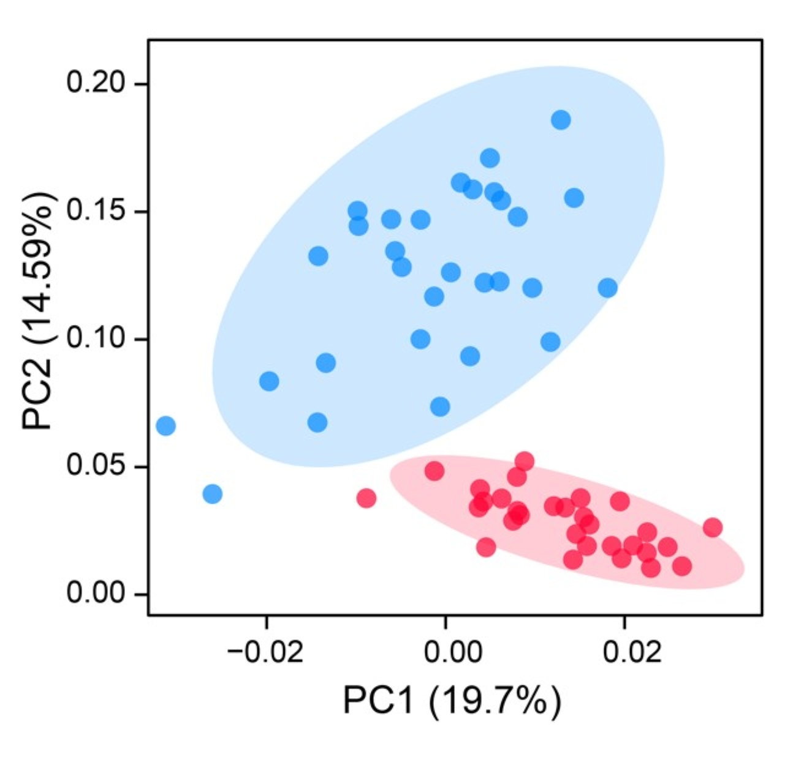
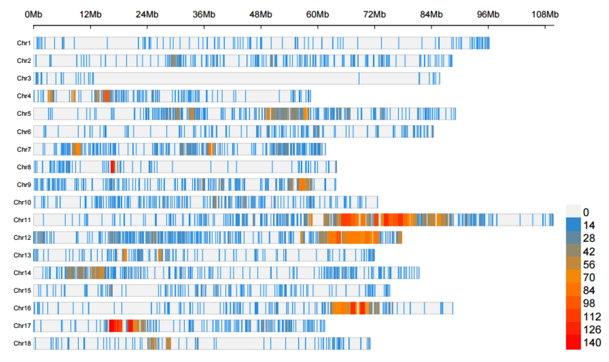
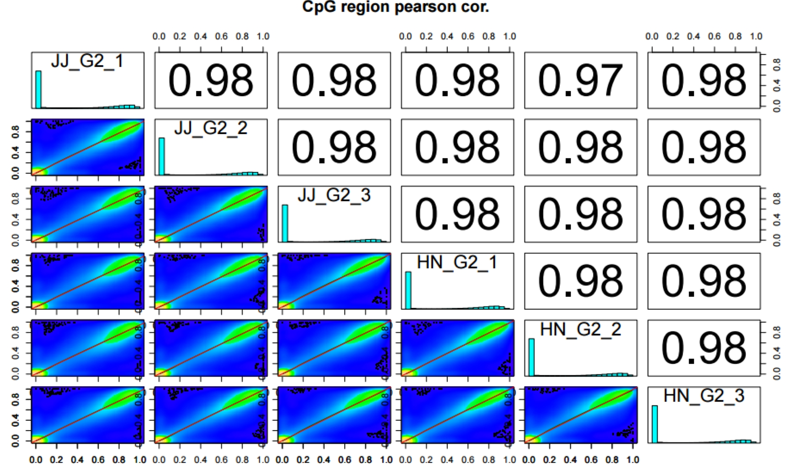

- [PopGeneticsVis](#popgeneticsvis)
 - [1. Installation](#1-installation)
    - [1.1 R with Packages](#11-r-with-packages)
    - [1.2 Download from GitHub Release](#12-download-from-github-release)
    - [1.3 Clone Git Repository](#13-clone-git-repository)
  - [2. Documents](#2-documents)
    - [2.1 WGRS PLINK PCA Vis](#21-wgrs-plink-pca-vis)
      - [2.1.1 Termial Running](#211-termial-running)
      - [2.1.2 PLINK PCA results `./PopGeneticsVis/data/plink_pca/pca.eigenvec`](#212-plink-pca-results-popgeneticsvisdataplink_pcapcaeigenvec)
      - [2.1.3 PLINK PCA results `./PopGeneticsVis/data/plink_pca/pca.eigenval`](#213-plink-pca-results-popgeneticsvisdataplink_pcapcaeigenval)
      - [2.1.4 WGRS `./PopGeneticsVis/data/plink_pca/samples_pops.txt`](#214-wgrs-popgeneticsvisdataplink_pcasamples_popstxt)
    - [2.2 WGRS VCFtools Tajima'D Vis](#22-wgrs-vcftools-tajimad-vis)
      - [2.2.1 Terminal Running](#221-terminal-running)
      - [2.2.2 VCFtools Tajima'D results `./PopGeneticsVis/data/vcftools_tajimad/all.Tajima.D`](#222-vcftools-tajimad-results-popgeneticsvisdatavcftools_tajimadalltajimad)
    - [2.3 WGRS PLINK Heterozyg Vis](#23-wgrs-plink-heterozyg-vis)
      - [2.3.1 Terminal Running](#231-terminal-running)
      - [2.3.2 PLINK Heterozyg results `./PopGeneticsVis/data/plink_het/het.het`](#232-plink-heterozyg-results-popgeneticsvisdataplink_hethethet)
      - [2.3.3 WGRS `./PopGeneticsVis/data/plink_het/samples_pops.txt`](#233-wgrs-popgeneticsvisdataplink_hetsamples_popstxt)
    - [2.4 WGRS VCFtools FST and XPCLR XPCLR Vis](#24-wgrs-vcftools-fst-and-xpclr-xpclr-vis)
      - [2.4.1 Terminal Running](#241-terminal-running)
      - [2.4.2 VCFtools FST results `./PopGeneticsVis/data/vcftools_fst/FST_JJ_G2_vs_HN_G2.windowed.weir.fst.chr.anno`](#242-vcftools-fst-results-popgeneticsvisdatavcftools_fstfst_jj_g2_vs_hn_g2windowedweirfstchranno)
      - [2.4.3 XPCLR XPCLR results `./PopGeneticsVis/data/xpclr_xpclr/JJ_G2_vs_HN_G2.xpclr.chr.anno`](#243-xpclr-xpclr-results-popgeneticsvisdataxpclr_xpclrjj_g2_vs_hn_g2xpclrchranno)
    - [2.5 WGBS MethylDackel Cytosine Ratio Vis](#25-wgbs-methyldackel-cytosine-ratio-vis)
      - [2.5.1 Terminal Running](#251-terminal-running)
      - [2.5.2 MethylDackel Cytosine Report `./PopGeneticsVis/data/cytosine_report/HN_G2_1.cytosine_report.txt`](#252-methyldackel-cytosine-report-popgeneticsvisdatacytosine_reporthn_g2_1cytosine_reporttxt)
    - [2.6 MethylKit DMR Analysis and Vis](#26-methylkit-dmr-analysis-and-vis)
      - [2.6.1 Terminal Running](#261-terminal-running)
      - [2.6.2 MethylDackel Cytosine Report `./PopGeneticsVis/data/cytosine_report/JJ_G2_1.cytosine_report.txt`](#262-methyldackel-cytosine-report-popgeneticsvisdatacytosine_reportjj_g2_1cytosine_reporttxt)
      - [2.6.3 MethylKit DMR results `./PopGeneticsVis/data/cytosine_report/JJ_G2_vs_HN_G2_DMR_CpG_2k.txt`](#263-methylkit-dmr-results-popgeneticsvisdatacytosine_reportjj_g2_vs_hn_g2_dmr_cpg_2ktxt)
      - [2.6.4 MethylKit DMR results `./PopGeneticsVis/data/cytosine_report/JJ_G2_vs_HN_G2_DMR_CpG_2k_Sig_Anno.txt`](#264-methylkit-dmr-results-popgeneticsvisdatacytosine_reportjj_g2_vs_hn_g2_dmr_cpg_2k_sig_annotxt)
    - [2.7 MethylKit Context Vis](#27-methylkit-context-vis)
      - [2.7.1 Terminal Running](#271-terminal-running)
      - [2.7.2 MethylKit Context Stats `./PopGeneticsVis/data/methyl_context/context_stats.txt`](#272-methylkit-context-stats-popgeneticsvisdatamethyl_contextcontext_statstxt)
    - [2.8 MethylKit DMR Violin Vis](#28-methylkit-dmr-violin-vis)
      - [2.8.1 Terminal Running](#281-terminal-running)
      - [2.8.2 MethylKit DMR Sig `./PopGeneticsVis/data/methylkit_dmr/JJ_G2_vs_HN_G2_DMR_CpG_2k_Sig.txt`](#282-methylkit-dmr-sig-popgeneticsvisdatamethylkit_dmrjj_g2_vs_hn_g2_dmr_cpg_2k_sigtxt)

# PopGeneticsVis
PopGeneticsVis: a toolkit for whole-genome resequencing and bisulfite sequencing downstream visualization in population genetics.

PopGeneticsVis is a comprehensive toolkit specifically designed for the downstream visualization of whole - genome resequencing and bisulfite sequencing in the context of population genetics. It serves as an essential resource for researchers delving into population - level genetic analysis, enabling them to effectively visualize and interpret the complex data generated from these sequencing techniques. This toolkit provides a set of tools and functions that streamline the process of transforming raw sequencing data into meaningful visual representations, facilitating a deeper understanding of genetic patterns, variations, and epigenetic modifications within populations.

## 1. Installation

### 1.1 R with Packages

```R
# 1. R: >= v4.3.0

# 2. Packages
# 2.1 CRAN
cran_packages <- c("argparse", "CMplot", "dplyr", "tidyr", "stringr", "data.table", "ggplot2", "ggpubr")
install.packages(cran_packages)

# 2.2 Bioconductor
if (!require("BiocManager", quietly = TRUE))
    install.packages("BiocManager")

bioconductor_packages <- c("methylKit", "GenomicFeatures", "rtracklayer", "GenomicRanges")
BiocManager::install(bioconductor_packages)
```

### 1.2 Download from GitHub Release

[*https://github.com/benben-miao/PopGeneticsVis/releases*](https://github.com/benben-miao/PopGeneticsVis/releases)

### 1.3 Clone Git Repository

```bash
# 1. Clone
git clone https://github.com/benben-miao/PopGeneticsVis.git

# 2. Test
Rscript ./PopGeneticsVis/bin/plink_pca_vis.R --help

usage: ./PopGeneticsVis/bin/plink_pca_vis.R [-h] --eigenvec EIGENVEC --eigenval EIGENVAL
                             --sample_pop SAMPLE_POP --select_pops SELECT_POPS
                             [--x_pc X_PC] [--y_pc Y_PC]
                             [--point_size POINT_SIZE]
                             [--point_alpha POINT_ALPHA]

PCA Visualization for PLINK PCA Eigenvec

optional arguments:
  -h, --help            show this help message and exit
  --eigenvec EIGENVEC   PLINK PCA results [pca.eigenvec].
  --eigenval EIGENVAL   PLINK PCA results [pca.eigenval].
  --sample_pop SAMPLE_POP
                        Table with samples in col1, pops in col2
                        [sample_pop.txt].
  --select_pops SELECT_POPS
                        Select populations ['GroupA,GroupB'].
  --x_pc X_PC           Which PC for X Axis [1].
  --y_pc Y_PC           Which PC for Y Axis [2].
  --point_size POINT_SIZE
                        Points size [4].
  --point_alpha POINT_ALPHA
                        Points alpha [0.8].
```

## 2. Documents

### 2.1 WGRS PLINK PCA Vis

PLINK (short for Whole-Genome Association Analysis Toolset) is one of the most commonly used tools in genome-wide association studies (GWAS) and population genetics research. Its built-in Principal Component Analysis (PCA) function can efficiently process large-scale genotype data, which is used to correct for population stratification or reveal the genetic structure of samples.

```bash
Rscript ./PopGeneticsVis/bin/plink_pca_vis.R --help

usage: ./PopGeneticsVis/bin/plink_pca_vis.R [-h] --eigenvec EIGENVEC --eigenval EIGENVAL
                             --sample_pop SAMPLE_POP --select_pops SELECT_POPS
                             [--x_pc X_PC] [--y_pc Y_PC]
                             [--point_size POINT_SIZE]
                             [--point_alpha POINT_ALPHA]

PCA Visualization for PLINK PCA Eigenvec

optional arguments:
  -h, --help            show this help message and exit
  --eigenvec EIGENVEC   PLINK PCA results [pca.eigenvec].
  --eigenval EIGENVAL   PLINK PCA results [pca.eigenval].
  --sample_pop SAMPLE_POP
                        Table with samples in col1, pops in col2
                        [sample_pop.txt].
  --select_pops SELECT_POPS
                        Select populations ['GroupA,GroupB'].
  --x_pc X_PC           Which PC for X Axis [1].
  --y_pc Y_PC           Which PC for Y Axis [2].
  --point_size POINT_SIZE
                        Points size [4].
  --point_alpha POINT_ALPHA
                        Points alpha [0.8].
```

#### 2.1.1 Termial Running

```bash
Rscript \
	./PopGeneticsVis/bin/plink_pca_vis.R \
	--eigenvec ./PopGeneticsVis/data/plink_pca/pca.eigenvec \
	--eigenval ./PopGeneticsVis/data/plink_pca/pca.eigenval \
	--sample_pop ./PopGeneticsVis/data/plink_pca/samples_pops.txt \
	--select_pops "JJ_G2,HN_G2" \
	--x_pc 1 --y_pc 2 \
	--point_size 4 --point_alpha 0.8
```



#### 2.1.2 PLINK PCA results `./PopGeneticsVis/data/plink_pca/pca.eigenvec`

```bash
head -n 10 ./PopGeneticsVis/data/plink_pca/pca.eigenvec

#FID    IID     PC1     PC2     PC3     PC4     PC5     PC6     PC7     PC8     PC9     PC10
HN_G2_1 HN_G2_1 0.04043 -0.0253789      0.0367277       0.00133413      -0.100252       -0.0905802      0.0113605       -0.0137787      -0.00668236     0.0167026
HN_G2_10        HN_G2_10        0.0212835       0.00859226      -0.0506521      -0.023103       0.0270852       -0.0357936      0.00354596      -0.020354       1.16024e-05     0.0141656
HN_G2_11        HN_G2_11        0.0127448       0.00981976      -0.067746       -0.0214325      -0.0301917      -0.0183634      -0.0200866      -0.00592332     -0.0141271      0.14919
HN_G2_12        HN_G2_12        0.0172671       0.022466        -0.0228558      0.0474678       -0.05247        0.0371412       -0.0215446      -0.0304079      0.0416183       0.0017122
HN_G2_13        HN_G2_13        0.0292439       0.0168136       -0.00497563     0.0267906       -0.0675681      0.0251754       -0.00228862     -0.0429644      0.0618089       -0.0117392
HN_G2_14        HN_G2_14        0.0158522       0.0359309       -0.0488923      0.0203213       0.00240803      -0.012922       0.0210997       -0.0185264      0.0167203       0.0338862
HN_G2_15        HN_G2_15        0.00289866      -0.00861881     -0.0898324      0.0208598       0.0670552       -0.173035       -0.035361       -0.0510791      -0.0171244      -0.0316206
HN_G2_16        HN_G2_16        0.0265133       0.00541896      -0.045698       -0.0219957      0.0469065       0.0547635       0.0421172       -0.0974258      -0.0106709      0.0287779
HN_G2_17        HN_G2_17        0.0250258       0.0229324       -0.0335188      0.00408936      -0.00744732     -0.0204986      0.023825        -0.010836       0.069014        0.0448165
```

<details>
	<summary>Click to unfold the Table</summary>

| #FID     | IID      | PC1        | PC2         | PC3         | PC4        | PC5         | PC6        | PC7         | PC8         | PC9         | PC10       |
|----------|----------|------------|-------------|-------------|------------|-------------|------------|-------------|-------------|-------------|------------|
| HN_G2_1  | HN_G2_1  | 0.04043    | -0.0253789  | 0.0367277   | 0.00133413 | -0.100252   | -0.0905802 | 0.0113605   | -0.0137787  | -0.00668236 | 0.0167026  |
| HN_G2_10 | HN_G2_10 | 0.0212835  | 0.00859226  | -0.0506521  | -0.023103  | 0.0270852   | -0.0357936 | 0.00354596  | -0.020354   | 1.16E-05    | 0.0141656  |
| HN_G2_11 | HN_G2_11 | 0.0127448  | 0.00981976  | -0.067746   | -0.0214325 | -0.0301917  | -0.0183634 | -0.0200866  | -0.00592332 | -0.0141271  | 0.14919    |
| HN_G2_12 | HN_G2_12 | 0.0172671  | 0.022466    | -0.0228558  | 0.0474678  | -0.05247    | 0.0371412  | -0.0215446  | -0.0304079  | 0.0416183   | 0.0017122  |
| HN_G2_13 | HN_G2_13 | 0.0292439  | 0.0168136   | -0.00497563 | 0.0267906  | -0.0675681  | 0.0251754  | -0.00228862 | -0.0429644  | 0.0618089   | -0.0117392 |
| HN_G2_14 | HN_G2_14 | 0.0158522  | 0.0359309   | -0.0488923  | 0.0203213  | 0.00240803  | -0.012922  | 0.0210997   | -0.0185264  | 0.0167203   | 0.0338862  |
| HN_G2_15 | HN_G2_15 | 0.00289866 | -0.00861881 | -0.0898324  | 0.0208598  | 0.0670552   | -0.173035  | -0.035361   | -0.0510791  | -0.0171244  | -0.0316206 |
| HN_G2_16 | HN_G2_16 | 0.0265133  | 0.00541896  | -0.045698   | -0.0219957 | 0.0469065   | 0.0547635  | 0.0421172   | -0.0974258  | -0.0106709  | 0.0287779  |
| HN_G2_17 | HN_G2_17 | 0.0250258  | 0.0229324   | -0.0335188  | 0.00408936 | -0.00744732 | -0.0204986 | 0.023825    | -0.010836   | 0.069014    | 0.0448165  |
</details>

#### 2.1.3 PLINK PCA results `./PopGeneticsVis/data/plink_pca/pca.eigenval`

```bash
cat ./PopGeneticsVis/data/plink_pca/pca.eigenval

9.91596
7.34118
5.66223
4.90547
4.37931
4.00635
3.89641
3.54522
3.51559
3.16454
```

#### 2.1.4 WGRS `./PopGeneticsVis/data/plink_pca/samples_pops.txt`

```bash
head -n 10 ./PopGeneticsVis/data/plink_pca/samples_pops.txt

HN_G2_1 HN_G2
HN_G2_2 HN_G2
HN_G2_3 HN_G2
HN_G2_4 HN_G2
HN_G2_5 HN_G2
HN_G2_6 HN_G2
HN_G2_7 HN_G2
HN_G2_8 HN_G2
HN_G2_9 HN_G2
HN_G2_10        HN_G2
```

### 2.2 WGRS VCFtools Tajima'D Vis

In population genetics research, Tajima's D test is one of the core methods for evaluating the deviation of DNA sequence polymorphism from the neutral evolution model, and VCFtools (Variant Call Format tools) is a commonly used tool for quickly calculating Tajima's D values based on VCF files (a standard format for storing genetic variation data).

```bash
usage: ./PopGeneticsVis/bin/vcftools_tajimad_vis.R [-h] --tajimad_win TAJIMAD_WIN --select_pops SELECT_POPS
                   [--box_outliers BOX_OUTLIERS]

VCFtools TajimaD Violin Box Vis

optional arguments:
  -h, --help            show this help message and exit
  --tajimad_win TAJIMAD_WIN
                        VCFtools TajimaD with ordered POP [all.Tajima.D].
  --select_pops SELECT_POPS
                        Select populations ['GroupA,GroupB'].
  --box_outliers BOX_OUTLIERS
                        Show box outliers uppercase [FALSE].
```

#### 2.2.1 Terminal Running

```bash
Rscript \
	./PopGeneticsVis/bin/vcftools_tajimad_vis.R \
	--tajimad_win ./PopGeneticsVis/data/vcftools_tajimad/all.Tajima.D \
	--select_pops "JJ_G2,HN_G2" \
	--box_outliers TRUE
```


#### 2.2.2 VCFtools Tajima'D results `./PopGeneticsVis/data/vcftools_tajimad/all.Tajima.D`

```bash
head -n 10 ./PopGeneticsVis/data/vcftools_tajimad/all.Tajima.D

CHROM   BIN_START       N_SNPS  TajimaD POP
11      10000   4       -1.51583        HN_G2
11      20000   0       nan     HN_G2
11      30000   3       -0.504447       HN_G2
11      40000   0       nan     HN_G2
11      50000   0       nan     HN_G2
11      60000   0       nan     HN_G2
11      70000   0       nan     HN_G2
11      80000   0       nan     HN_G2
11      90000   0       nan     HN_G2
```
<details>
	<summary>Click to unfold the Table</summary>
	
| **CHROM** | **BIN_START** | **N_SNPS** | **TajimaD** | **POP** |
|-----------|---------------|------------|-------------|---------|
| 11        | 10000         | 4          | -1.51583    | HN_G2   |
| 11        | 20000         | 0          | nan         | HN_G2   |
| 11        | 30000         | 3          | -0.504447   | HN_G2   |
| 11        | 40000         | 0          | nan         | HN_G2   |
| 11        | 50000         | 0          | nan         | HN_G2   |
| 11        | 60000         | 0          | nan         | HN_G2   |
| 11        | 70000         | 0          | nan         | HN_G2   |
| 11        | 80000         | 0          | nan         | HN_G2   |
| 11        | 90000         | 0          | nan         | HN_G2   |
</details>

### 2.3 WGRS PLINK Heterozyg Vis

In PLINK (a commonly used tool for genome-wide association studies), Heterozyg (Heterozygosity) is a core indicator for measuring the genetic diversity of samples or loci. It reflects the degree to which an individual carries two different alleles (such as A/T) at a specific locus, or the frequency of the distribution of heterozygous alleles at a locus in a population.

```bash
usage: ./PopGeneticsVis/bin/plink_heterozyg_vis.R [-h] --het_data HET_DATA --sample_pop SAMPLE_POP --select_pops
             SELECT_POPS [--point_size POINT_SIZE]

PLINK Heterozyg Violin Box Vis

optional arguments:
  -h, --help            show this help message and exit
  --het_data HET_DATA   PLINK Heterozyg results [het.het].
  --sample_pop SAMPLE_POP
                        Table with IID in col1 and Population in col2
                        [sample_pop.txt].
  --select_pops SELECT_POPS
                        Select populations ['GroupA,GroupB'].
  --point_size POINT_SIZE
                        Point size [2].
```

#### 2.3.1 Terminal Running

```bash
Rscript \
	./PopGeneticsVis/bin/plink_heterozyg_vis.R \
	--het_data ./PopGeneticsVis/data/plink_het/het.het \
	--sample_pop ./PopGeneticsVis/data/plink_het/samples_pops.txt \
	--select_pops "JJ_G2,HN_G2" \
	--point_size 2
```


#### 2.3.2 PLINK Heterozyg results `./PopGeneticsVis/data/plink_het/het.het`

```bash
head -n 10 ./PopGeneticsVis/data/plink_het/het.het

#FID	IID	O(HOM)	E(HOM)	OBS_CT	F
HN_G2_1	HN_G2_1	19048512	1.81455e+07	20585181	0.370148
HN_G2_10	HN_G2_10	19053719	1.804e+07	20467745	0.417557
HN_G2_11	HN_G2_11	18950164	1.79458e+07	20366876	0.414843
HN_G2_12	HN_G2_12	19064469	1.79607e+07	20383072	0.455651
HN_G2_13	HN_G2_13	19222145	1.8105e+07	20549246	0.457051
HN_G2_14	HN_G2_14	18908338	1.8013e+07	20444064	0.368286
HN_G2_15	HN_G2_15	19256769	1.80381e+07	20474025	0.50029
HN_G2_16	HN_G2_16	19041670	1.80191e+07	20453626	0.420034
HN_G2_17	HN_G2_17	19309606	1.81539e+07	20603448	0.471799
```
<details>
	<summary>Click to unfold the Table</summary>
	
| **#FID** | **IID**  | **O(HOM)** | **E(HOM)** | **OBS_CT** | **F**    |
|----------|----------|------------|------------|------------|----------|
| HN_G2_1  | HN_G2_1  | 19048512   | 1.81E+07   | 20585181   | 0.370148 |
| HN_G2_10 | HN_G2_10 | 19053719   | 1.80E+07   | 20467745   | 0.417557 |
| HN_G2_11 | HN_G2_11 | 18950164   | 1.79E+07   | 20366876   | 0.414843 |
| HN_G2_12 | HN_G2_12 | 19064469   | 1.80E+07   | 20383072   | 0.455651 |
| HN_G2_13 | HN_G2_13 | 19222145   | 1.81E+07   | 20549246   | 0.457051 |
| HN_G2_14 | HN_G2_14 | 18908338   | 1.80E+07   | 20444064   | 0.368286 |
| HN_G2_15 | HN_G2_15 | 19256769   | 1.80E+07   | 20474025   | 0.50029  |
| HN_G2_16 | HN_G2_16 | 19041670   | 1.80E+07   | 20453626   | 0.420034 |
| HN_G2_17 | HN_G2_17 | 19309606   | 1.82E+07   | 20603448   | 0.471799 |
</details>

#### 2.3.3 WGRS `./PopGeneticsVis/data/plink_het/samples_pops.txt`

```bash
head -n 10 ./PopGeneticsVis/data/plink_het/samples_pops.txt

HN_G2_1 HN_G2
HN_G2_2 HN_G2
HN_G2_3 HN_G2
HN_G2_4 HN_G2
HN_G2_5 HN_G2
HN_G2_6 HN_G2
HN_G2_7 HN_G2
HN_G2_8 HN_G2
HN_G2_9 HN_G2
HN_G2_10        HN_G2
```

### 2.4 WGRS VCFtools FST and XPCLR XPCLR Vis

VCFtools (Variant Call Format tools) is a core set of tools for processing VCF (Variant Call Format) files in population genetics, while FST (Fixation Index) is a key indicator for measuring the degree of genetic differentiation between populations. The combination of the two can efficiently analyze the genetic differences between different populations at the genomic level, and is widely used in fields such as population structure research, domestication site localization, and adaptive evolution analysis.

```bash
usage: ./PopGeneticsVis/bin/cmplot_fst_xpclr.R [-h] [--method {FST,XPCLR}] --fst_xpclr FST_XPCLR
                      [--plot_type {m,c,d,q}]

CMplot for FST or XPCLR results annotation

optional arguments:
  -h, --help            show this help message and exit
  --method {FST,XPCLR}  SNP selection methods [FST].
  --fst_xpclr FST_XPCLR
                        FST or XPCLR results with anno [fst.anno].
  --plot_type {m,c,d,q}
                        Plot type m(Manhattan), c(Circle), d(Density), q(QQ-
                        plot) [m].
```

#### 2.4.1 Terminal Running

```bash
Rscript \
	./PopGeneticsVis/bin/cmplot_fst_xpclr.R \
	--method FST \
	--fst_xpclr ./PopGeneticsVis/data/vcftools_fst/FST_JJ_G2_vs_HN_G2.windowed.weir.fst.chr.anno \
	--plot_type d
```



```bash
Rscript \
	./PopGeneticsVis/bin/cmplot_fst_xpclr.R \
	--method FST \
	--fst_xpclr ./PopGeneticsVis/data/vcftools_fst/FST_JJ_G2_vs_HN_G2.windowed.weir.fst.chr.anno \
	--plot_type m
```


```bash
Rscript \
	./PopGeneticsVis/bin/cmplot_fst_xpclr.R \
	--method FST \
	--fst_xpclr ./PopGeneticsVis/data/vcftools_fst/FST_JJ_G2_vs_HN_G2.windowed.weir.fst.chr.anno \
	--plot_type c
```


#### 2.4.2 VCFtools FST results `./PopGeneticsVis/data/vcftools_fst/FST_JJ_G2_vs_HN_G2.windowed.weir.fst.chr.anno`

```bash
head -n 10 ./PopGeneticsVis/data/vcftools_fst/FST_JJ_G2_vs_HN_G2.windowed.weir.fst.chr.anno

CHROM   BIN_START       BIN_END N_VARIANTS      WEIGHTED_FST    MEAN_FST        anno_type       gene_id
chr11   10001   20000   7       0.0436644       0.0239114       promoter,gene,UTR5,CDS,exon,intron,UTR3 HdF041849(p),HdF041849(g)
chr11   15001   25000   7       0.0436644       0.0239114       promoter,gene,UTR5,exon,intron  HdF041849(p),HdF041849(g)
chr11   25001   35000   4       0.0150391       0.0161973       intergenic
chr11   30001   40000   4       0.0150391       0.0161973       intergenic
chr11   55001   65000   1       -0.00444874     -0.00444874     intergenic
chr11   60001   70000   1       -0.00444874     -0.00444874     intergenic
chr11   270001  280000  15      0.0511696       0.0366771       gene,UTR5,CDS,exon,intron,UTR3  HdF041844(g)
chr11   275001  285000  15      0.0511696       0.0366771       gene,UTR5,exon,intron   HdF041844(g)
chr11   300001  310000  8       0.0526581       0.0448139       intergenic
```
<details>
	<summary>Click to unfold the Table</summary>
	
| **CHROM** | **BIN_START** | **BIN_END** | **N_VARIANTS** | **WEIGHTED_FST** | **MEAN_FST** | **anno_type**                           | **gene_id**               |
|-----------|---------------|-------------|----------------|------------------|--------------|-----------------------------------------|---------------------------|
| chr11     | 10001         | 20000       | 7.00E+00       | 0.0436644        | 0.0239114    | promoter,gene,UTR5,CDS,exon,intron,UTR3 | HdF041849(p),HdF041849(g) |
| chr11     | 15001         | 25000       | 7.00E+00       | 0.0436644        | 0.0239114    | promoter,gene,UTR5,exon,intron          | HdF041849(p),HdF041849(g) |
| chr11     | 25001         | 35000       | 4.00E+00       | 0.0150391        | 0.0161973    | intergenic                              |                           |
| chr11     | 30001         | 40000       | 4.00E+00       | 0.0150391        | 0.0161973    | intergenic                              |                           |
| chr11     | 55001         | 65000       | 1.00E+00       | -0.00444874      | -0.00444874  | intergenic                              |                           |
| chr11     | 60001         | 70000       | 1.00E+00       | -0.00444874      | -0.00444874  | intergenic                              |                           |
| chr11     | 270001        | 280000      | 1.50E+01       | 0.0511696        | 0.0366771    | gene,UTR5,CDS,exon,intron,UTR3          | HdF041844(g)              |
| chr11     | 275001        | 285000      | 1.50E+01       | 0.0511696        | 0.0366771    | gene,UTR5,exon,intron                   | HdF041844(g)              |
| chr11     | 300001        | 310000      | 8.00E+00       | 0.0526581        | 0.0448139    | intergenic                              |                           |
</details>

#### 2.4.3 XPCLR XPCLR results `./PopGeneticsVis/data/xpclr_xpclr/JJ_G2_vs_HN_G2.xpclr.chr.anno`

XPCLR (Cross-Population Composite Likelihood Ratio) is a commonly used analytical tool in population genetics for detecting selection signals, and it is particularly suitable for studying differences in genomic regions among different populations caused by natural selection. Its core principle is to calculate the "composite likelihood ratio" for each locus on the genome by comparing the differences in allele frequencies between two populations and incorporating linkage disequilibrium (LD) information, thereby identifying regions that may be affected by positive selection (or other selective pressures). Such regions usually exhibit population differentiation signals significantly higher than the genomic background level.

```bash
head -n 10 ./PopGeneticsVis/data/xpclr_xpclr/JJ_G2_vs_HN_G2.xpclr.chr.anno

chrom   start   stop    pos_start       pos_stop        modelL  nullL   sel_coef        nSNPs   nSNPs_avail     xpclr   xpclr_norm      anno_type       gene_id
chr1    110001  120000  116131  119955  -35.0884425294439       -40.1089557348041       1e-04   16      16      10.0410264107203        -0.0638126714140551     intergenic
chr1    115001  125000  116131  124815  -66.45676465399 -66.885874161588        5e-05   26      26      0.858219015196113       -0.465779523577906      intergenic
chr1    120001  130000  121746  129981  -78.2152330276062       -88.4911108160588       1e-04   31      31      20.5517555769051        0.396282431847874       intergenic
chr1    125001  135000  125362  134705  -109.377249276282       -109.686346377196       1e-05   41      41      0.618194201828032       -0.476286334242127      intergenic
chr1    130001  140000  130307  139709  -108.695950408831       -115.431457733638       2e-04   50      50      13.4710146496142        0.0863311262244798      intergenic
chr1    135001  145000  135498  144985  -158.605704897143       -169.662861526333       4e-04   65      65      22.1143132583807        0.464681600587198       intergenic
chr1    140001  150000  141304  149997  -154.800677159078       -154.800677159078       0       54      54      0       -0.503347075759572      intergenic
chr1    145001  155000  145791  154842  -81.9384742813194       -82.1444387953709       5e-05   31      31      0.411929028102946       -0.485315355435985      intergenic
chr1    150001  160000  150028  159925  -44.0246980239117       -50.7171763729386       4e-04   19      19      13.3849566980539        0.0825640381867617      intergenic
```

<details>
	<summary>Click to unfold the Table</summary>
	
| **chrom** | **start** | **stop** | **pos_start** | **pos_stop** | **modelL**   | **nullL**    | **sel_coef** | **nSNPs** | **nSNPs_avail** | **xpclr**   | **xpclr_norm** | **anno_type** |
|-----------|-----------|----------|---------------|--------------|--------------|--------------|--------------|-----------|-----------------|-------------|----------------|---------------|
| chr1      | 110001    | 120000   | 1.16E+05      | 119955       | -35.08844253 | -40.10895573 | 1.00E-04     | 16        | 16              | 10.04102641 | -0.063812671   | intergenic    |
| chr1      | 115001    | 125000   | 1.16E+05      | 124815       | -66.45676465 | -66.88587416 | 5.00E-05     | 26        | 26              | 8.58E-01    | -0.465779524   | intergenic    |
| chr1      | 120001    | 130000   | 1.22E+05      | 129981       | -78.21523303 | -88.49111082 | 1.00E-04     | 31        | 31              | 20.55175558 | 0.396282432    | intergenic    |
| chr1      | 125001    | 135000   | 1.25E+05      | 134705       | -109.3772493 | -109.6863464 | 1.00E-05     | 41        | 41              | 0.618194202 | -0.476286334   | intergenic    |
| chr1      | 130001    | 140000   | 1.30E+05      | 139709       | -108.6959504 | -115.4314577 | 2.00E-04     | 50        | 50              | 13.47101465 | 0.086331126    | intergenic    |
| chr1      | 135001    | 145000   | 1.35E+05      | 144985       | -158.6057049 | -169.6628615 | 4.00E-04     | 65        | 65              | 22.11431326 | 0.464681601    | intergenic    |
| chr1      | 140001    | 150000   | 1.41E+05      | 149997       | -154.8006772 | -154.8006772 | 0            | 54        | 54              | 0           | -0.503347076   | intergenic    |
| chr1      | 145001    | 155000   | 1.46E+05      | 154842       | -81.93847428 | -82.1444388  | 5.00E-05     | 31        | 31              | 0.411929028 | -0.485315355   | intergenic    |
| chr1      | 150001    | 160000   | 1.50E+05      | 159925       | -44.02469802 | -50.71717637 | 4.00E-04     | 19        | 19              | 13.3849567  | 0.082564038    | intergenic    |
</details>

```bash
Rscript \
	./PopGeneticsVis/bin/cmplot_fst_xpclr.R \
	--method XPCLR \
	--fst_xpclr ./PopGeneticsVis/data/xpclr_xpclr/JJ_G2_vs_HN_G2.xpclr.chr.anno \
	--plot_type d
```

```bash
Rscript \
	./PopGeneticsVis/bin/cmplot_fst_xpclr.R \
	--method XPCLR \
	--fst_xpclr ./PopGeneticsVis/data/xpclr_xpclr/JJ_G2_vs_HN_G2.xpclr.chr.anno \
	--plot_type m
```

```bash
Rscript \
	./PopGeneticsVis/bin/cmplot_fst_xpclr.R \
	--method XPCLR \
	--fst_xpclr ./PopGeneticsVis/data/xpclr_xpclr/JJ_G2_vs_HN_G2.xpclr.chr.anno \
	--plot_type c
```

### 2.5 WGBS MethylDackel Cytosine Ratio Vis

cytosine_report (cytosine report) is a core file related to WGBS (Whole Genome Bisulfite Sequencing) data analysis. It is mainly used to store key information about cytosine sites in DNA methylation research, supporting subsequent methylation level visualization and Differential Methylation Region (DMR) analysis.

```bash
usage: ./PopGeneticsVis/bin/cytosine_ratio_vis.R [-h] --cytosine_report CYTOSINE_REPORT
                             [--sample_num SAMPLE_NUM]

Methyl Ratio Vis for SytosineReport

options:
  -h, --help            show this help message and exit
  --cytosine_report CYTOSINE_REPORT
                        Cytosine report from Bismark/MethylDackel
                        [./cytosine_report.txt].
  --sample_num SAMPLE_NUM
                        Methyl site number for visualization [1000000].
```

#### 2.5.1 Terminal Running

```bash
Rscript \
	./PopGeneticsVis/bin/cytosine_ratio_vis.R \
	--cytosine_report ./PopGeneticsVis/data/cytosine_report/HN_G2_1.cytosine_report.txt \
	--sample_n 1000000
```


#### 2.5.2 MethylDackel Cytosine Report `./PopGeneticsVis/data/cytosine_report/HN_G2_1.cytosine_report.txt`

```bash
head -n 10 ./PopGeneticsVis/data/cytosine_report/HN_G2_1.cytosine_report.txt

mith1tg000589c  2       +       0       18      CHH     CCC
mith1tg000589c  3       +       0       19      CHH     CCC
mith1tg000589c  4       +       0       19      CHH     CCC
mith1tg000589c  5       +       0       21      CHG     CCG
mith1tg000589c  6       +       0       25      CG      CGT
mith1tg000589c  7       -       0       0       CG      CGG
mith1tg000589c  14      +       0       27      CG      CGC
mith1tg000589c  15      -       0       0       CG      CGT
mith1tg000589c  16      +       1       28      CHH     CCC
mith1tg000589c  17      +       1       29      CHH     CCT
```

<details>
	<summary>Click to unfold the Table</summary>
	
| mith1tg000589c | 2  | + | 0        | 18 | CHH | CCC |
|----------------|----|---|----------|----|-----|-----|
| mith1tg000589c | 3  | + | 0.00E+00 | 19 | CHH | CCC |
| mith1tg000589c | 4  | + | 0.00E+00 | 19 | CHH | CCC |
| mith1tg000589c | 5  | + | 0.00E+00 | 21 | CHG | CCG |
| mith1tg000589c | 6  | + | 0.00E+00 | 25 | CG  | CGT |
| mith1tg000589c | 7  | - | 0.00E+00 | 0  | CG  | CGG |
| mith1tg000589c | 14 | + | 0.00E+00 | 27 | CG  | CGC |
| mith1tg000589c | 15 | - | 0.00E+00 | 0  | CG  | CGT |
| mith1tg000589c | 16 | + | 1.00E+00 | 28 | CHH | CCC |
| mith1tg000589c | 17 | + | 1.00E+00 | 29 | CHH | CCT |
</details>

### 2.6 MethylKit DMR Analysis and Vis

```bash
usage: ./PopGeneticsVis/bin/methylkit_dmr.R [-h] --control CONTROL --treated TREATED --in_dir
                           IN_DIR --out_dir OUT_DIR [--threads THREADS]
                           [--nrep NREP] [--level {DMC,DMR,DMP}]
                           [--context {CpG,CHG,CHH}] [--mincov MINCOV]
                           [--win_size WIN_SIZE] [--step_size STEP_SIZE]
                           [--corr_method {pearson,kendall,spearman}]
                           [--adjust_method {SLIM,holm,hochberg,hommel,bonferroni,BH,BY,fdr,none,qvalue}]
                           [--test_method {F,Chisq,fast.fisher,midPval}]
                           [--qvalue_cutoff QVALUE_CUTOFF]
                           [--meth_cutoff METH_CUTOFF] [--gtf GTF]
                           [--promoter_up PROMOTER_UP]
                           [--promoter_down PROMOTER_DOWN]
                           [--plot_width PLOT_WIDTH]
                           [--plot_height PLOT_HEIGHT]

MethylKit Analysis Workflow

options:
  -h, --help            show this help message and exit
  --control CONTROL     Control group name.
  --treated TREATED     Treated group name.
  --in_dir IN_DIR       Input directory [./].
  --out_dir OUT_DIR     Output directory [./].
  --threads THREADS     Threads, more CPUs more Mems need [1].
  --nrep NREP           Samples replicates each group [3].
  --level {DMC,DMR,DMP}
                        Methylation level [DMR].
  --context {CpG,CHG,CHH}
                        Methylation context [CpG].
  --mincov MINCOV       Minimum coverage [10].
  --win_size WIN_SIZE   Window size for DMR (bp) [2000].
  --step_size STEP_SIZE
                        Step size for DMR (bp) [2000].
  --corr_method {pearson,kendall,spearman}
                        Correlation method [pearson].
  --adjust_method {SLIM,holm,hochberg,hommel,bonferroni,BH,BY,fdr,none,qvalue}
                        P-value adjustment method [SLIM].
  --test_method {F,Chisq,fast.fisher,midPval}
                        Statistical test method [Chisq].
  --qvalue_cutoff QVALUE_CUTOFF
                        Q-value cutoff [0.05].
  --meth_cutoff METH_CUTOFF
                        Methylation difference cutoff [25].
  --gtf GTF             GTF/GFF of genome [NULL].
  --promoter_up PROMOTER_UP
                        Promoter upstream distance (bp) [2000]
  --promoter_down PROMOTER_DOWN
                        Promoter downstream distance (bp) [200]
  --plot_width PLOT_WIDTH
                        Plot width (inch) [10.00].
  --plot_height PLOT_HEIGHT
                        Plot height (inch) [10.00].
```

#### 2.6.1 Terminal Running

```bash
genome_gtf="/path_to_gtf/genome.gtf"

Rscript \
	./PopGeneticsVis/bin/methylkit_dmr.R \
	--control JJ_G2 \
	--treated HN_G2 \
	--in_dir ./PopGeneticsVis/data/cytosine_report/ \
	--out_dir ./PopGeneticsVis/data/cytosine_report/ \
	--threads 1 \
	--nrep 3 \
	--level DMR \
	--context CpG \
	--mincov 10 \
	--win_size 2000 \
	--step_size 2000 \
	--corr_method pearson \
	--adjust_method SLIM \
	--test_method Chisq \
	--qvalue_cutoff 0.05 \
	--meth_cutoff 25 \
	--gtf ${genome_gtf} \
	--promoter_up 2000 \
	--promoter_down 200 \
	--plot_width 10.00 \
	--plot_height 6.18
```




#### 2.6.2 MethylDackel Cytosine Report `./PopGeneticsVis/data/cytosine_report/JJ_G2_1.cytosine_report.txt`

```bash
head -n 10 ./PopGeneticsVis/data/cytosine_report/JJ_G2_1.cytosine_report.txt

chr2    1       +       0       0       CHG     CTG
chr2    3       -       0       2       CHG     CAG
chr2    5       +       0       0       CHH     CAT
chr2    8       +       0       0       CHG     CTG
chr2    10      -       2       1       CHG     CAG
chr2    12      +       0       0       CHH     CTC
chr2    14      +       0       0       CHH     CCT
chr2    15      +       0       0       CHH     CTC
chr2    17      +       0       0       CHH     CTC
chr2    19      +       0       0       CHH     CTC
```

<details>
	<summary>Click to unfold the Table</summary>
	
| chr2 | 1  | + | 0        | 0 | CHG | CTG |
|------|----|---|----------|---|-----|-----|
| chr2 | 3  | - | 0.00E+00 | 2 | CHG | CAG |
| chr2 | 5  | + | 0.00E+00 | 0 | CHH | CAT |
| chr2 | 8  | + | 0.00E+00 | 0 | CHG | CTG |
| chr2 | 10 | - | 2.00E+00 | 1 | CHG | CAG |
| chr2 | 12 | + | 0.00E+00 | 0 | CHH | CTC |
| chr2 | 14 | + | 0.00E+00 | 0 | CHH | CCT |
| chr2 | 15 | + | 0.00E+00 | 0 | CHH | CTC |
| chr2 | 17 | + | 0.00E+00 | 0 | CHH | CTC |
| chr2 | 19 | + | 0.00E+00 | 0 | CHH | CTC |
</details>

#### 2.6.3 MethylKit DMR results `./PopGeneticsVis/data/cytosine_report/JJ_G2_vs_HN_G2_DMR_CpG_2k.txt`

```bash
head -n 10 ./PopGeneticsVis/data/cytosine_report/JJ_G2_vs_HN_G2_DMR_CpG_2k.txt

chr     start   end     strand  pvalue  qvalue  meth.diff
chr1    94001   96000   *       0.359806000563359       0.387704326219981       0.152798303668958
chr1    96001   98000   *       0.470816921695121       0.456792909828252       -0.0848647129274156
chr1    98001   100000  *       0.000872125098979439    0.0030624412141788      -0.51115564900546
chr1    100001  102000  *       0.14767572092135        0.21438828041915        0.144018353504898
chr1    102001  104000  *       0.96580550253059        0.6773458835649 -0.00530964695794603
chr1    104001  106000  *       0.797705926039805       0.614400356560997       -0.0539165519981705
chr1    106001  108000  *       0.00835614419137723     0.0219464554487716      1.44288691348377
chr1    110001  112000  *       1.30699444113323e-06    8.11073044542023e-06    1.90364567269138
chr1    112001  114000  *       0.000328168930580941    0.00127959885901375     0.694565505097805


head -n 10 ./PopGeneticsVis/data/cytosine_report/JJ_G2_vs_HN_G2_DMR_CpG_2k_Sig.txt

chr     start   end     strand  pvalue  qvalue  meth.diff
chr1    466001  468000  *       0.00415711849409238     0.0120671167427604      -27.3170731707317
chr1    660001  662000  *       4.04113325784691e-09    3.62260475171775e-08    -33.3792540435737
chr1    1454001 1456000 *       8.93917792092073e-12    1.08386220427317e-10    -26.5563101301641
chr1    2750001 2752000 *       2.71610876608368e-129   5.71042756213395e-127   25.0474473214157
chr1    3428001 3430000 *       2.04907237864629e-10    2.14432834251086e-09    -46.3312368972746
chr1    3604001 3606000 *       2.13785433427291e-09    1.9841040640047e-08     37.8574305275876
chr1    4488001 4490000 *       3.46668153028929e-25    1.05232051309453e-23    -28.1260194808221
chr1    4934001 4936000 *       0.00170753601022128     0.00555652046196457     26.3565891472868
chr1    5294001 5296000 *       1.09733414650907e-08    9.28758216013033e-08    -58.5365853658537
```

<details>
	<summary>Click to unfold the Table</summary>
	
| **chr** | **start** | **end** | **strand** | **pvalue**  | **qvalue**  | **meth.diff** |
|---------|-----------|---------|------------|-------------|-------------|---------------|
| chr1    | 94001     | 96000   | *          | 0.359806001 | 0.387704326 | 0.152798304   |
| chr1    | 96001     | 98000   | *          | 0.470816922 | 0.45679291  | -0.084864713  |
| chr1    | 98001     | 100000  | *          | 0.000872125 | 0.003062441 | -0.511155649  |
| chr1    | 100001    | 102000  | *          | 0.147675721 | 0.21438828  | 0.144018354   |
| chr1    | 102001    | 104000  | *          | 0.965805503 | 0.677345884 | -0.005309647  |
| chr1    | 104001    | 106000  | *          | 0.797705926 | 0.614400357 | -0.053916552  |
| chr1    | 106001    | 108000  | *          | 0.008356144 | 0.021946455 | 1.442886913   |
| chr1    | 110001    | 112000  | *          | 1.31E-06    | 8.11E-06    | 1.903645673   |
| chr1    | 112001    | 114000  | *          | 0.000328169 | 0.001279599 | 0.694565505   |
</details>

#### 2.6.4 MethylKit DMR results `./PopGeneticsVis/data/cytosine_report/JJ_G2_vs_HN_G2_DMR_CpG_2k_Sig_Anno.txt`

```bash
head -n 10 ./PopGeneticsVis/data/cytosine_report/JJ_G2_vs_HN_G2_DMR_CpG_2k_Sig_Anno.txt

chr     start   end     strand  pvalue  qvalue  meth.diff       anno_genes      anno_promoters
chr1    466001  468000  *       0.00415711849409238     0.0120671167427604      -27.3170731707317       HdF051575       NA
chr1    660001  662000  *       4.04113325784691e-09    3.62260475171775e-08    -33.3792540435737       HdF051575       NA
chr1    1454001 1456000 *       8.93917792092073e-12    1.08386220427317e-10    -26.5563101301641       HdF027216       NA
chr1    2750001 2752000 *       2.71610876608368e-129   5.71042756213395e-127   25.0474473214157        NA      NA
chr1    3428001 3430000 *       2.04907237864629e-10    2.14432834251086e-09    -46.3312368972746       HdF027234       NA
chr1    3604001 3606000 *       2.13785433427291e-09    1.9841040640047e-08     37.8574305275876        HdF027242       NA
chr1    4488001 4490000 *       3.46668153028929e-25    1.05232051309453e-23    -28.1260194808221       HdF027261       NA
chr1    4934001 4936000 *       0.00170753601022128     0.00555652046196457     26.3565891472868        HdF027275       NA
chr1    5294001 5296000 *       1.09733414650907e-08    9.28758216013033e-08    -58.5365853658537       NA      NA
```

<details>
	<summary>Click to unfold the Table</summary>
	
| **chr** | **start** | **end** | **strand** | **pvalue**  | **qvalue**  | **meth.diff** | **anno_genes** | **anno_promoters** |
|---------|-----------|---------|------------|-------------|-------------|---------------|----------------|--------------------|
| chr1    | 466001    | 468000  | *          | 0.004157118 | 0.012067117 | -27.31707317  | HdF051575      | NA                 |
| chr1    | 660001    | 662000  | *          | 4.04E-09    | 3.62E-08    | -33.37925404  | HdF051575      | NA                 |
| chr1    | 1454001   | 1456000 | *          | 8.94E-12    | 1.08E-10    | -26.55631013  | HdF027216      | NA                 |
| chr1    | 2750001   | 2752000 | *          | 2.72E-129   | 5.71E-127   | 25.04744732   | NA             | NA                 |
| chr1    | 3428001   | 3430000 | *          | 2.05E-10    | 2.14E-09    | -46.3312369   | HdF027234      | NA                 |
| chr1    | 3604001   | 3606000 | *          | 2.14E-09    | 1.98E-08    | 37.85743053   | HdF027242      | NA                 |
| chr1    | 4488001   | 4490000 | *          | 3.47E-25    | 1.05E-23    | -28.12601948  | HdF027261      | NA                 |
| chr1    | 4934001   | 4936000 | *          | 1.71E-03    | 5.56E-03    | 26.35658915   | HdF027275      | NA                 |
| chr1    | 5294001   | 5296000 | *          | 1.10E-08    | 9.29E-08    | -58.53658537  | NA             | NA                 |
</details>

### 2.7 MethylKit Context Vis

MethylKit Context is a core analytical dimension in epigenetics (especially in DNA methylation analysis) based on the methylKit toolkit (commonly used for whole-genome bisulfite sequencing, WGBS, data analysis). It focuses on the distribution patterns and quantitative statistics of DNA methylation in different genomic contexts.

```bash
usage: ./PopGeneticsVis/bin/context_pie_vis.R [-h] --subjects_parts SUBJECTS_PARTS [--col_num COL_NUM]

Multi-Pie row: subjects; col: parts

optional arguments:
  -h, --help            show this help message and exit
  --subjects_parts SUBJECTS_PARTS
                        Row: subjects; Col: parts [./subjects_parts.txt].
  --col_num COL_NUM     Columns/Pies in row [3].
```

#### 2.7.1 Terminal Running

```bash
Rscript \
	./PopGeneticsVis/bin/context_pie_vis.R \
	--subjects_parts ./PopGeneticsVis/data/methyl_context/context_stats.txt \
	--col_num 3
```


#### 2.7.2 MethylKit Context Stats `./PopGeneticsVis/data/methyl_context/context_stats.txt`

```bash
cat ./PopGeneticsVis/data/methyl_context/context_stats.txt

Subject	CpG	CHG	CHH
JJ_G2_HN_G2	79674962	111393332	399114039
DMRs	602647	607166	609247
DMRs_Sig	5925	11	15
```

### 2.8 MethylKit DMR Violin Vis

MethylKit is an open-source bioinformatics toolkit based on the R language, specifically designed for processing high-throughput methylation sequencing data (such as WGBS, RRBS, MeDIP-seq, etc.) and analyzing differential methylation. Among these, Differentially Methylated Regions (DMRs) are one of its core analysis targets — that is, specific regions in the genome where there are significant differences in methylation levels between different sample groups (e.g., disease group vs. normal group, treatment group vs. control group). These regions are key entry points for 解析 the biological functions regulated by methylation (such as gene expression, cell differentiation, and disease occurrence).

```bash
usage: ./PopGeneticsVis/bin/methylkit_dmr_violin.R [-h] --methylkit_dmr METHYLKIT_DMR
                                 [--violin_scale {area,count,width}]
                                 [--violin_width VIOLIN_WIDTH]
                                 [--point_size POINT_SIZE]

Meth.Diff Hyper & Hypo Violin Plot

options:
  -h, --help            show this help message and exit
  --methylkit_dmr METHYLKIT_DMR
                        MethylKit DMR results (chr, start, end, ...,
                        meth.diff) [./methylkit_dmr.txt].
  --violin_scale {area,count,width}
                        Violin area and width [count].
  --violin_width VIOLIN_WIDTH
                        Violin width percent [1].
  --point_size POINT_SIZE
                        Point size [1.5].
```

#### 2.8.1 Terminal Running

```bash
Rscript \
	./PopGeneticsVis/bin/methylkit_dmr_violin.R \
	--methylkit_dmr ./PopGeneticsVis/data/methylkit_dmr/JJ_G2_vs_HN_G2_DMR_CpG_2k_Sig.txt \
	--violin_scale count \
	--violin_width 1 \
	--point_size 1.5
```


```bash
Rscript \
	./PopGeneticsVis/bin/methylkit_dmr_violin.R \
	--methylkit_dmr ./PopGeneticsVis/data/methylkit_dmr/JJ_G2_vs_HN_G2_DMR_CHG_2k_Sig.txt \
	--violin_scale count \
	--violin_width 1 \
	--point_size 1.5
```


```bash
Rscript \
	./PopGeneticsVis/bin/methylkit_dmr_violin.R \
	--methylkit_dmr ./PopGeneticsVis/data/methylkit_dmr/JJ_G2_vs_HN_G2_DMR_CHH_2k_Sig.txt \
	--violin_scale count \
	--violin_width 1 \
	--point_size 1.5
```


#### 2.8.2 MethylKit DMR Sig `./PopGeneticsVis/data/methylkit_dmr/JJ_G2_vs_HN_G2_DMR_CpG_2k_Sig.txt`

```bash
head -n 10 ./PopGeneticsVis/data/methylkit_dmr/JJ_G2_vs_HN_G2_DMR_CpG_2k_Sig.txt

chr	start	end	strand	pvalue	qvalue	meth.diff
chr1	466001	468000	*	0.00415711849409238	0.0120671167427604	-27.3170731707317
chr1	660001	662000	*	4.04113325784691e-09	3.62260475171775e-08	-33.3792540435737
chr1	1454001	1456000	*	8.93917792092073e-12	1.08386220427317e-10	-26.5563101301641
chr1	2750001	2752000	*	2.71610876608368e-129	5.71042756213395e-127	25.0474473214157
chr1	3428001	3430000	*	2.04907237864629e-10	2.14432834251086e-09	-46.3312368972746
chr1	3604001	3606000	*	2.13785433427291e-09	1.9841040640047e-08	37.8574305275876
chr1	4488001	4490000	*	3.46668153028929e-25	1.05232051309453e-23	-28.1260194808221
chr1	4934001	4936000	*	0.00170753601022128	0.00555652046196457	26.3565891472868
chr1	5294001	5296000	*	1.09733414650907e-08	9.28758216013033e-08	-58.5365853658537
```
<details>
	<summary>Click to unfold the Table</summary>
	
| **chr** | **start** | **end** | **strand** | **pvalue**  | **qvalue**  | **meth.diff** |
|---------|-----------|---------|------------|-------------|-------------|---------------|
| chr1    | 466001    | 468000  | *          | 0.004157118 | 0.012067117 | -27.31707317  |
| chr1    | 660001    | 662000  | *          | 4.04E-09    | 3.62E-08    | -33.37925404  |
| chr1    | 1454001   | 1456000 | *          | 8.94E-12    | 1.08E-10    | -26.55631013  |
| chr1    | 2750001   | 2752000 | *          | 2.72E-129   | 5.71E-127   | 25.04744732   |
| chr1    | 3428001   | 3430000 | *          | 2.05E-10    | 2.14E-09    | -46.3312369   |
| chr1    | 3604001   | 3606000 | *          | 2.14E-09    | 1.98E-08    | 37.85743053   |
| chr1    | 4488001   | 4490000 | *          | 3.47E-25    | 1.05E-23    | -28.12601948  |
| chr1    | 4934001   | 4936000 | *          | 1.71E-03    | 5.56E-03    | 26.35658915   |
| chr1    | 5294001   | 5296000 | *          | 1.10E-08    | 9.29E-08    | -58.53658537  |
</details>
